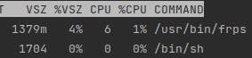

# Load Testing

### Summary

1) Difference between ingress and ingress-less is pretty small (from 2 ms to 100 ms)
2) Response time on ingress-less has a bit higher difference between min and max values then ingress 
(mostly because sometimes opening  connections can take more time)
3) Amount of passive (when no requests sent) tunnels does not influence on server performance (cpu and memory 
increase for about 1% and 50 MB for keeping 3000 tunnels)
4) Server normally handles huge amount of tunnels (3000) with reasonable amount of requests (about 60 req/sec)
with no additional delay (about 280 ms)
5) When load grows (about 200 - 500 req/sec) the more tunnels handle requests -> the higher response time
(though the cpu and memory does not seem to grow)


## Ingress vs Ingress-less

Prerequisites:

1) one frp server instance on gcp cluster (?which resources)
2) aws cluster (m2.large)
3) having nginx echo server
4) having ingress pointing to this nginx
5) having tunnel client pointing to this nginx
6) 1 user ~ 0.8 req/sec (in this iteration)

Analyzing these results we can see that the median value is mostly the same (which tells us that half of requests for 
both ingress and ingress-less had less or equal response time).

Average response time differs and on ingress-less it grows faster when load is being increased.

#### 10 users:

```
ingress:
     http_req_duration..............: avg=170.1ms  min=119.51ms med=138.23ms max=421.28ms p(90)=230.15ms p(95)=247.55ms
ingress-less:
     http_req_duration..............: avg=240.51ms min=121.96ms med=133.18ms max=1.07s    p(90)=565.07ms p(95)=657.62ms
```


#### 100 users:

```
ingress:
     http_req_duration..............: avg=135.82ms min=117.28ms med=129.01ms max=750.72ms p(90)=142.98ms p(95)=177.4ms
ingress-less:
     http_req_duration..............: avg=238.26ms min=120.87ms med=130.75ms max=3.02s    p(90)=515ms    p(95)=625.58ms
```


#### 1000 users:

```
ingress:
     http_req_duration..............: avg=146.51ms min=117.14ms med=131.49ms max=1.68s   p(90)=189.43ms p(95)=253.98ms
ingress-less:
     http_req_duration..............: avg=393.37ms min=117.01ms med=142.91ms max=6.05s   p(90)=1.07s    p(95)=1.45s   
```

## Amount of tunnels

Prerequisites:
1) one frp server instance on gcp cluster (?which resources)
2) 3000 tunnels run on local machine (all connected to server)

Though it does not seem to be the cpu bottleneck on the server side (it never grows higher than 3-4%)


##### Note: we expect that the bottleneck was either network on cluster or on local machine (where clients were run)

#### 3000 tunnels -- sending requests to all of them

These measurements show how server acts when having 3000 tunnels connected and sending different amount of req/sec.

As you can see until the load crosses the threshold of 500 threads the average response time grows really slow.

```
~6 req/sec (10 threads, 1s interval):
     http_req_duration..............: avg=270.08ms min=237.93ms med=243.7ms  max=481.58ms p(90)=377.68ms p(95)=404.65ms
~60 req/sec (100 threads, 1s interval):
     http_req_duration..............: avg=285.91ms min=246.79ms med=256.82ms max=737.97ms p(90)=381.46ms p(95)=455.45ms
~120 req/sec (200 threads, 1s interval):
     http_req_duration..............: avg=320.45ms min=246.3ms  med=273.83ms max=756.44ms p(90)=466.24ms p(95)=509.54ms
~180 req/sec (300 threads, 1s interval):
     http_req_duration..............: avg=318.07ms min=247.15ms med=271.37ms max=1.14s    p(90)=456.77ms p(95)=547.66ms
~230 req/sec (400 threads, 1s interval):
     http_req_duration..............: avg=337.98ms min=247.04ms med=290.56ms max=1.73s    p(90)=452.71ms p(95)=587.6ms 
~230 req/sec (500 threads, 1s interval):
     http_req_duration..............: avg=384.27ms min=247.95ms med=306.41ms max=14.95s   p(90)=558.76ms p(95)=740.68ms
~260 req/sec (600 threads, 1s interval):
     http_req_duration..............: avg=494.2ms  min=247.65ms med=402.66ms max=16.2s   p(90)=737.24ms p(95)=981.17ms
```

#### 3000 tunnels + requests to different amount of them

The load was always the same (sending requests from 600 different threads with interval of 1 sec),
but due to delays of processing amount of actual req/sec was different (because each thread was waiting for its request).

Here we can see that on huge load response time grows when number of simultaneous tunnels transferring these requests grows.
It's because when a new request comes to a tunnel it opens additional connection with client. And the more different tunnels 
handle requests the more connections we finally open. 

```
10 tunnels -- ~400 req/sec:
     http_req_duration..............: avg=386.8ms  min=246.09ms med=282.56ms max=2.35s    p(90)=582.7ms  p(95)=742.81ms
100 tunnels -- ~320 req/sec:
     http_req_duration..............: avg=503.47ms min=248.31ms med=334.39ms max=6.05s    p(90)=636.34ms p(95)=874.65ms
500 tunnels -- ~320 req/sec:
     http_req_duration..............: avg=443.99ms min=248.32ms med=335.17ms max=3.61s   p(90)=571.98ms p(95)=690.55ms
1000 tunnels -- ~270 req/sec:
     http_req_duration..............: avg=524.26ms min=250.04ms med=345.33ms max=12.8s   p(90)=692.71ms p(95)=882.57ms
2000 tunnels -- ~250 req/sec:
     http_req_duration..............: avg=424.1ms  min=248.07ms med=335.74ms max=25.87s   p(90)=688.49ms p(95)=925.56ms
3000 tunnels -- ~250 req/sec:
     http_req_duration..............: avg=494.2ms  min=247.65ms med=402.66ms max=16.2s   p(90)=737.24ms p(95)=981.17ms

```

## Single vs Multiple (2) instances

#### 100 users -- 400 tunnels

```
single:
     http_req_duration..............: avg=280.3ms  min=244.82ms med=247.18ms max=907.99ms p(90)=316.65ms p(95)=488.53ms
multiple:
     http_req_duration..............: avg=417.67ms min=236.44ms med=255.25ms max=5.54s    p(90)=431.64ms p(95)=477.52ms
```

#### 100 users -- 600 tunnels

```
single:
     http_req_duration..............: avg=366.23ms min=244.35ms med=255.19ms max=3.02s   p(90)=828.86ms p(95)=967.18ms
multiple:
     http_req_duration..............: avg=900.39ms min=0s       med=259.14ms max=51.2s   p(90)=982.5ms  p(95)=1.39s   
```

#### 500 users -- 400 tunnels

```
single:
     http_req_duration..............: avg=1.01s    min=0s       med=360.24ms max=20.23s  p(90)=2.06s    p(95)=3.6s    
multiple:
     http_req_duration..............: avg=1.08s    min=121.42ms med=331.67ms max=51.52s  p(90)=1.3s     p(95)=10.15s  
```

#### 500 users -- 600 tunnels

```
single:
     http_req_duration..............: avg=1.98s    min=0s       med=1.69s    max=11.5s   p(90)=4.39s    p(95)=5.17s   
multiple:
     http_req_duration..............: avg=1.89s    min=0s       med=1.25s    max=36.93s  p(90)=4.4s     p(95)=5.78s   
```

#### 1000 users -- 600 tunnels

```
single:
     http_req_duration..............: avg=3.88s    min=0s       med=3.03s    max=45.97s  p(90)=7.33s    p(95)=9.78s   
multiple:
     http_req_duration..............: avg=5.03s    min=0s       med=4.2s     max=51.53s  p(90)=10.03s   p(95)=13.46s  
```
